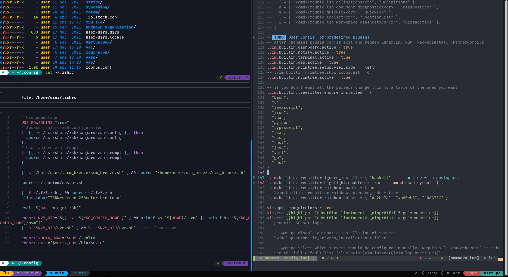

# Dev Setup

My development setup. Includes dotfiles/configs, apps, tools, vscode extensions, neovim plugins, etc.

## List of tools

### Terminal tools

#### Shell

- [zsh](https://www.zsh.org/) - a Unix shell
- [oh-my-zsh](https://github.com/robbyrussell/oh-my-zsh) - zsh config with bells and whistles
- [zsh-syntax-highlighting](https://github.com/zsh-users/zsh-syntax-highlighting) - syntax highlighting for zsh
- [zsh-autosuggestions](https://github.com/zsh-users/zsh-autosuggestions) - autosuggestions for zsh
- [starship](https://starship.rs/) - shell prompt

#### Files

- [ranger](https://github.com/ranger/ranger) - terminal file manager
- [bat](https://github.com/sharkdp/bat) - same as `cat` but with syntax highlighting
- [exa](https://github.com/ogham/exa) - same as `ls` but with syntax highlighting
- [fasd](https://github.com/clvv/fasd) - quick access to files and directories
- [tree](http://mama.indstate.edu/users/ice/tree/) - recursive directory listing command

#### Git

- [git](https://github.com/git/git) - version control tool
- [tig](https://github.com/jonas/tig) - text-mode interface for git
- [scm_breeze](https://github.com/scmbreeze/scm_breeze) - a set of shell scripts that enhance your interaction with git

#### Search

- [fzf](https://github.com/junegunn/fzf) - command-line fuzzy finder
- [ripgrep](https://github.com/BurntSushi/ripgrep) - `grep` alternative
- [fd](https://github.com/sharkdp/fd) - find files and folders. same as `find` but better

#### Http

- [curl](https://github.com/curl/curl) - command-line tool for transferring data specified with URL syntax
- [httpie](https://github.com/httpie/httpie) - command-line HTTP client

#### Text editors

- [neovim](https://github.com/neovim/neovim) - terminal text editor
- [LunarVim](https://github.com/LunarVim/LunarVim) - neovim with plugins for development
- [Neovide](https://github.com/neovide/neovide) - GUI for Neovim

#### Documentation

- [cheat.sh](https://github.com/chubin/cheat.sh) - cheat sheets in terminal
- [tldr](https://github.com/tldr-pages/tldr) - community-maintained help pages
- [navi](https://github.com/denisidoro/navi) - interactive cheatsheet tool for the command-line
- [zk](https://github.com/mickael-menu/zk) - zettelkasten tool for creating notes and personal wiki

#### Other terminal tools

- [tmux](https://github.com/tmux/tmux) - terminal multiplexer
- [.tmux](https://github.com/gpakosz/.tmux) - tmux config
- [zellij](https://github.com/zellij-org/zellij) - modern tmux replacement
- [htop](https://github.com/htop-dev/htop) - interactive process viewer
- [xclip](https://github.com/astrand/xclip) - cli clipboard
- [yank](https://github.com/mptre/yank) - copy terminal output to clipboard
- [jq](https://github.com/stedolan/jq) - command-line JSON processor
- [jid](https://github.com/simeji/jid) - Json Incremental Digger

### GUI Tools

- [VSCode](https://code.visualstudio.com/) - IDE
- [Firefox](https://www.mozilla.org/en-US/firefox) - web browser
- [Postman](https://www.postman.com) - API platform for building and using API
- [flameshot](https://github.com/flameshot-org/flameshot) - screenshot tool
- [keepassxc](https://github.com/keepassxreboot/keepassxc) - local password manager
- [dbeaver](https://github.com/dbeaver/dbeaver) - multi-platform database client

#### For Linux

- [guake](https://github.com/Guake/guake) - terminal emulator
- [alacritty](https://github.com/alacritty/alacritty) - terminal emulator
- [Albert](https://github.com/albertlauncher/albert) - launcher fox linux
- [Opensnitch](https://github.com/evilsocket/opensnitch) - linux application firewall
- [rofi](https://github.com/davatorium/rofi) - launcher
- [firejail](https://github.com/netblue30/firejail) - sandbox
- [peek](https://github.com/phw/peek) - animated GIF recorder

#### For MacOS

- [Marta](https://marta.sh/) - file manager
- [LuLu](https://github.com/objective-see/LuLu) - firewall
- [Alfred](https://www.alfredapp.com/) - launcher and productivity app

### Fonts

- [Fira Code](https://github.com/tonsky/FiraCode)
- [Hack](https://github.com/source-foundry/Hack)

### VSCode Extensions

- [Settings Sync](https://marketplace.visualstudio.com/items?itemName=Shan.code-settings-sync) - synchronize settings
- [VSCode Neovim](https://marketplace.visualstudio.com/items?itemName=asvetliakov.vscode-neovim) - neovim navigation in vscode
- [MetaJump](https://marketplace.visualstudio.com/items?itemName=metaseed.MetaJump) - fast cursor moving using only keyboard
- [Code Spell Checker](https://marketplace.visualstudio.com/items?itemName=streetsidesoftware.code-spell-checker) - spell checker
- [LTeX](https://marketplace.visualstudio.com/items?itemName=valentjn.vscode-ltex) – LanguageTool grammar/spell checking
- [Live Share](https://marketplace.visualstudio.com/items?itemName=MS-vsliveshare.vsliveshare) - enables you to collaboratively edit and debug with others in real time
- [Error Lens](https://marketplace.visualstudio.com/items?itemName=usernamehw.errorlens) - inline errors
- [Todo Tree](https://marketplace.visualstudio.com/items?itemName=Gruntfuggly.todo-tree) - this extension quickly searches your workspace for comment tags like TODO and FIXME, and displays them in a tree view in the activity bar
- [Markdown All in One](https://marketplace.visualstudio.com/items?itemName=yzhang.markdown-all-in-one) - tools to work with markdown
- [Markdown Preview Enhanced](https://marketplace.visualstudio.com/items?itemName=shd101wyy.markdown-preview-enhanced) - markdown preview
- [SQL Formatter](https://marketplace.visualstudio.com/items?itemName=adpyke.vscode-sql-formatter) - format SQL files
- [shell-format](https://marketplace.visualstudio.com/items?itemName=foxundermoon.shell-format) - format shell files
- [Draw.io Integration](https://marketplace.visualstudio.com/items?itemName=hediet.vscode-drawio) - draw diagrams in vscode
- [GitLens](https://marketplace.visualstudio.com/items?itemName=eamodio.gitlens) — Git integration
- [Toggle Quotes](https://marketplace.visualstudio.com/items?itemName=BriteSnow.vscode-toggle-quotes) - toggle quotes with a shortcut
- [Better Comments](https://marketplace.visualstudio.com/items?itemName=aaron-bond.better-comments) - colorize comments
- [Activitus Bar](https://marketplace.visualstudio.com/items?itemName=Gruntfuggly.activitusbar) - smaller activity bar
- [Foam](https://marketplace.visualstudio.com/items?itemName=foam.foam-vscode) - zettelkasten note-taking tool
- [DevToys](https://marketplace.visualstudio.com/items?itemName=kejun.devtoys) - useful tools for developers

### NeoVim Plugins

- [LunarVim Core Plugins List](https://www.lunarvim.org/plugins/01-core-plugins-list.html) - plugins used in LunarVim
- [Trouble](https://github.com/folke/trouble.nvim) - show errors in-line
- [vim-prettier](https://github.com/prettier/vim-prettier) - prettier for vim
- [vim-visual-multi](https://github.com/mg979/vim-visual-multi) - multi-select in vim, similar to ctrl + d in vscode
- [vim-fugitive](https://github.com/tpope/vim-fugitive) - vim git plugin
- [nvim-ts-rainbow](https://github.com/p00f/nvim-ts-rainbow) - rainbow parentheses
- [indent-blankline](https://github.com/lukas-reineke/indent-blankline.nvim) - adds indentation guides to all lines
- [coc.nvim](https://github.com/neoclide/coc.nvim) - snippets
- [coc-spell-checker](https://github.com/iamcco/coc-spell-checker) - spell checker
- [persistence](https://github.com/folke/persistence.nvim) - automated session management
- [todo-comments](https://github.com/folke/todo-comments.nvim) - highlight todo comments
- [rnvimr](https://github.com/kevinhwang91/rnvimr) - use ranger file manager in a floating window inside vim
- [hop](https://github.com/phaazon/hop.nvim) - EasyMotion-like plugin allowing you to jump anywhere in a document with as few keystrokes as possible
- [diffview](https://github.com/sindrets/diffview.nvim) - easily cycling through diffs for all modified files

### Other

- [hosts](https://github.com/StevenBlack/hosts) - hosts file to block malicious sites, trackers, ads, etc.
